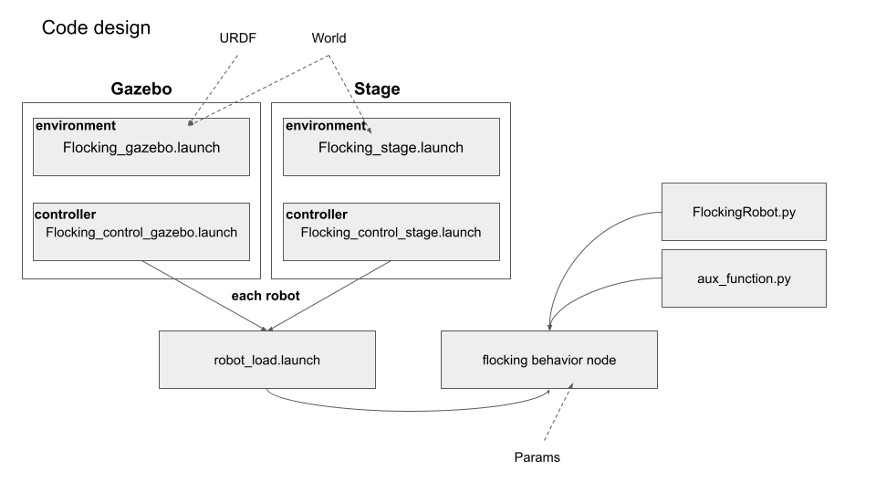
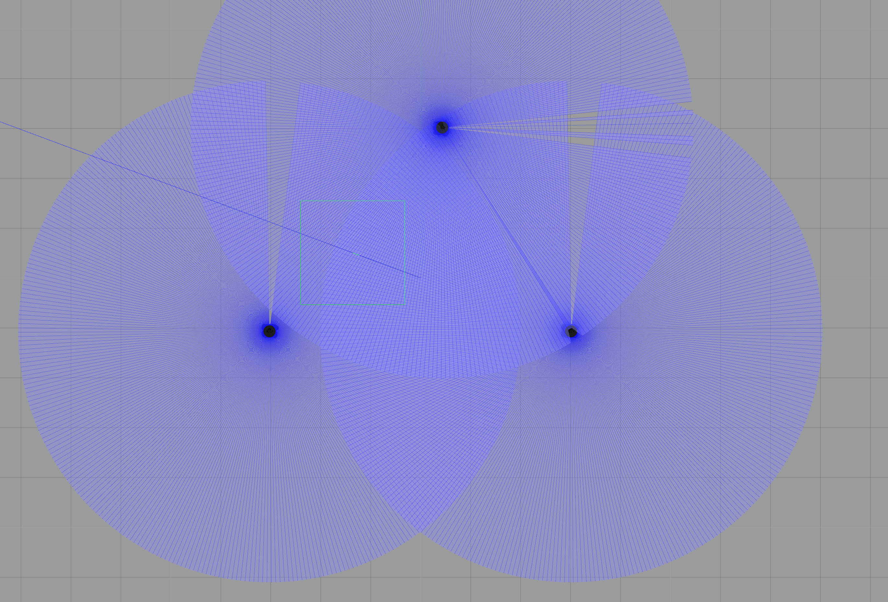
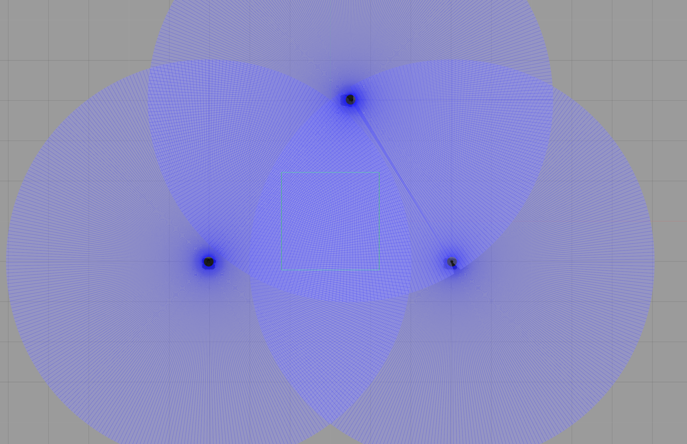
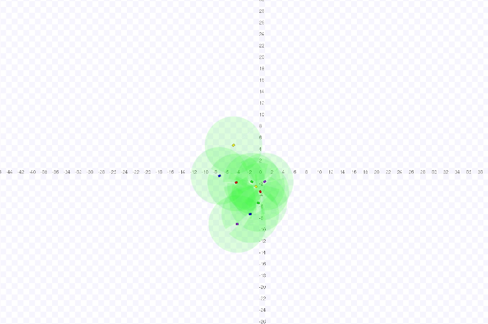

# flocking ROS package
### CS269 Multi Robot Systems / 2021 Spring / PA-2
### Mingi Jeong / mingi.jeong.gr@dartmouth.edu

## 1. General
* This package achieves flocking behaviors of multi robots with differential drives both in Gazebo and Stage. There is a subsidiary package to load a custom robot description.
* Two launch files under each environment (Gazebo or Stage) will be initiated.
    * First terminal: loading the simulation environment
    * Second terminal: executing flocking behavior control node
* The program is robust to achieve the flocking behavior, i. e., boids consisting of of three parts: alignment, cohesion, and separation.
* The package has a main running node in 'nodes' folder and essential code implementations (__FlockingRobot.py__, __aux_function.py__) such as functions and class in 'src/flocking' folder to make it re-usable. 

 

## 2. Method
### 1. Assumption
* Each robot starts at a pre-defined position with different yaw angle on 2D plane.
* The robot uses a laser scanner in case of any risky situations which can lead to a collision during the flocking behavior.
* The world environment is empty.
* The robot has two control state (0: flocking, 1: collision avoidance).
* I am inclined to aim for safer operations of flocking behaviors by waiting for a while (3 robot: < 20 sec, 10 robots: < 2 min) to reach stabilization of the flocking. __Note__ that as soon as the program starts, flocking behavior begins; however, I am referring to qualitatively stable observations.

### 2. Environment
* Gazebo
    * __Robot__: As seen in the readme of __custom_turtlbot3_description__ package, the turtlebot3 waffle_pi model has been modified as follows:
        * Ground truth plug in was added (in _gazebo.xacro_).
        * Laser scanner mounting position was modified to prevent false reading reflected from the robot own body (in _urdf.xacro_). I was able to exclude those blind spot area, but I made a more perfect assumption scenario with 360-degree readings.
        * Laser scanner range (5m) and frequency (10 Hz) was increased to give more robustness (in _gazebo.xacro_). 
    * __World__: Original world from turtlebot3_simulation by ROBOTIS has been modified.
        * I firstly made with isolate environment surrounded by barriers, but I decided to use an only empty plane after my question on Slack. The models are still in the folder.
        * Camera angle and orientation is set as a bird view for best visibility.
    

     
    
    

    <Fig 1. Original turtlebot3 model with blind spot resulting in ~0.1 meter readings for minimum distance always (up) modified turtlebot 3 model to give stable full 360-degree reading from the scanner>

​    
* Stage
    * __Robot__: 
        * I made a robot with a rectangular shape having similar size to turtlebot3.
        * The laser scanner has the same range limit as in Gazebo. It should be carefully mounted in a correct position (as observed in Gazebo), since a wrong position made no reflections from other objects. 
    * __World__: 
        * I am using an empty world to monitor flocking behaviors in a better way.
        * The world is modified from PA 1 world I made for TA in CS 181.
    
* Common
    * Rostopic
        * Each robot has its own subscriber to _laser scan_ and publisher to _cmd_vel_.
        * To subscribe other robot's ground truth data, first, I set up subscribers depending on the robot name (ID) except for own name. Then, the robot name is passed as an argument of a callback function, so that each robot can save information of the other robots in hash map. As a result, I was able to define only one common _call back function_ despite multiple subscribers. See line 45-61 and 105-122 in __FlockingRobot.py__.
        * Depending on the environment (Gazebo, Stage), there is a flag passed as rosparam which launches the node accordingly. This is because of the fact that topic name is different with prefix, e.g., robot_0 vs. tb3_0 and scan vs. base_scan. __Note__ that I am using Kinetic and there might be difference in topic name on Stage by Melodic. 
    * Running
        * After the environment is called, if `flocking_control` launch file is initiated, it runs each robot's node, i.e., 10 robot nodes for Stage. The node is implemented in nodes/flocking_behavior in a modular way with other source codes in src/flocking. Each node is named with post-fix of a robot ID.

### 3. Flocking behavior
* I used a simple method motivated by vector interactions.
* The program first ensures that all relevant data have been fed and control state is '0' for flocking behaviors. -- line 192 in __FlockingRobot.py__.
* __(1) Alignment__ (line 123)
    * I mapped the Euler angle heading (obtained from ground truth) to the unit vector (1 x 2) on 2D space represented by a numpy array. 
    * Using np.array([math.cos(other_hdg), math.sin(other_hdg)]), I return the average (normalized) of heading vectors of the other robots.

* __(2) Cohesion__ (line 137)
    * From the global frame, I get the average (normalized) of position vectors of the other robots.
    * Then, I calculate a vector from own robot position toward the average position vector. This vector is returned in a normalized format after summing up of all the other robot members.

* __(3) Separation__ (line 152)
    * From the global frame, I get a virtual repulsive vector from another robot to own robot. 
    * Based on the direction of a vector, I remapped that vector magnitude inverse proportional to the distance between own robot and the other robot. In other words, the shorter distance, the stronger vector force.
    * This is returned in a normalized format after summing up of all the other robot members.

* __Final output__
    * From the above steps (1)-(3), as you see, all the vectors were returned in a normalized format.
    * __Heading adjustment__:
        * One thing to keep in mind is that _alignment_ is solely not a factor to consider changing heading. Since the robot is based on a differential drive, _cohesion, separation_ also affect the heading in order to make the robot reach there.
        * After comparison with my heading vector (check_vector_angle in __aux_function.py__), I return how much the robot need to adjust its heading (line 221). 
        * In this step, each component is multiplied by a weight coefficient (will be explained in Discussion section) loaded from .yaml file. 
    * __Position adjustment__:
        * Different from heading adjustment, the alignment is not directly related to the x,y goal position on 2D plane.
        * Hence, _cohesion, separation_ only affect the linear motion, i.e., position adjustment of the robot. The same weight coefficient applies.
    * __Final cmd_vel__:
        * The values from the heading adjustment and the position adjustment represent 'error', 'how much action the robot needs to take', in a similar concept in PID controller.
        * The heading adjustment is related to angluar.z whereas the position adjustment is related to linear.x in _Twist_ message.
        * On top of the first weight coefficients applied above, the second layer scaling factors were applied to better fit into robot's actual linear.x and angular.z -- See Discussion section.

### 4. Finite state machine and obstacle avoidance
* For the safety of the robot, I implemented a laser scan-based obstacle avoidance controller with a finite state machine. 
* The high-level idea is that, during flocking behaviors, if the robot get close to another robot, the control state shifts to _'obstacle avoidance'_ mode. 
* The robot stops linear motion and turns in place (left +0.3 or right -0.3). The value is randomly chosen when the robot is instantiated. Therefore, not all the robots are turning in the same direction, making the program robust to avoid obstacle and escape from the deadlock situation.
* While turning, if there is enough room for the front side, the control state shifts back to _'flocking'_ mode.

## 3. Evaluation
* Please see the additional materials in video folder.
    * flocking-gazebo.mp4
    * flocking-stage.mp4
    * overcome-deadlock.mp4

1. Task performance
    * My code performs well with being well organized and commented I think.
    * The program has no problem with running 3 robots in Gazebo and 10 robots in Stage by making them robustly achieve flocking behaviors.
    * As a backup system with laser scan and finite state machine, the robots never collide with other obstacles and resume flocking behavior not being stuck in deadlock.

2. Discussion
    * Parameters (Weights and scaling factor in .yaml file)
        1.  Why they can be different in Gazebo vs. Stage?
        * In each simulation, even if I made a similar set up including the robot size and laser range, there are many different components such as dynamics, inertia of the robots. 
        * Rostopic Hz is also different depending on the environment.
        * In conclusion, I had to change and tune parameters to observe the qualitatively best behaviors.

        2. Two layers of parameters and how are they determined?
        * As mentioned in the method section, the first layer of parameters is for weight distribution to _alignment_, _cohesion_, _separation_. The second layer is scaling factor to be applied to linear.x and angular.z of _cmd_vel_.
        * I made the process easier by making all the previous steps return _normalized_ vectors. The limitation is that we need to determine five params without prior knowledge, but I decided them based on priorities from operator's view point, e.g., cohesion highest (to make robots converge).
        * This is empirically tested with several trial and errors, as one of diverse ways taught in the class. The approach is similar to finding parameters in a PID controller. 

    * Deadlock
        * For the safety of the robot, I used the laser scan to detect the short range output. The robot stops and turns in place to make its front side clear of any obstacle. 
        * Initial trials by making the robot just stop with a faulty designation of control state made the robots stuck in deadlock. This made the situation not back to normal flocking behaviors. 
        * I observed more deadlock cases with 10 robots in Stage as they were doing 'Cohesion'. 
        * With relevant parameter tuning as well as well-designed finite state machine, I was able to resolve this issue. I felt that resolving the deadlock took longer than implementing the flocking behavior.

    

     
    

<Fig 2. Example of a deadlock scenario where the robots are conducting the flocking behavior and collision avoidance.>
